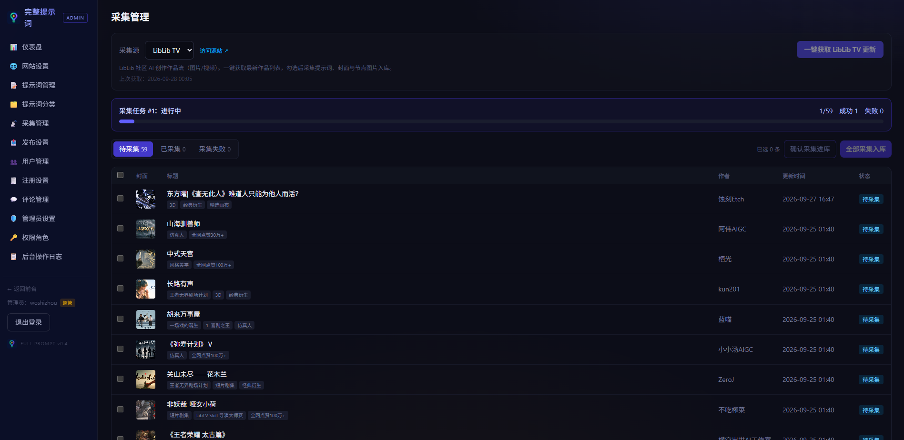

# 完整提示词 CompletePrompt（v0.4）

收集、分享、发现优质 AI 提示词的社区网站。内置 8400+ 条真实创作过程提示词（图片/视频/音频/文本），其中 4650+ 条含与提示词分段精确对应的实拍效果图与视频截图，全部本地化存储。

- 在线演示：https://www.wango8.com
- PC 端截图：
- 手机端截图：

-一键采集截图:
## 功能总览

### 前台
- **提示词浏览**：首页精选 / 热门推荐 / 分类浏览 / Meilisearch 全文搜索 / 标签筛选，卡片式响应式网格
- **详情页**：分段提示词（`[N] 标签｜…｜节点名`）与图片/视频截图精确对应、一键复制；TipTap 富文本正文（标题/列表/代码块/图片/视频）、原作品链接、点赞收藏胶囊按钮、自动中英翻译
- **用户系统**：注册登录（独立 JWT，HttpOnly Cookie，30 天）、个人中心（昵称/头像/简介）、点赞、收藏、发布提示词；注册字段（邮箱/昵称/手机号）后台可配
- **评论系统**：仅登录会员可评、游客只读；两级嵌套回复、评论点赞（防重）、删除自己的评论
  - 防刷：60 秒硬上限 6 条；第 4 条起触发算术验证码（一次性、5 分钟过期），敏感词命中自动等长 `**` 星号屏蔽后直发
  - 全站评论开关 + 单篇关评（旧评论保留显示）；管理员可禁言违规用户
- **会员体系**：free / Pro / VIP 三级，权益与价格后台可配置
- **响应式**：PC / 平板 / 手机三档自适应；手机端底部 Tab 导航（首页/热门/分类/我的），适配 iPhone 安全区

### 后台管理（隐蔽入口 `/guanli-7k2m9x`）
- **独立管理员体系**：与会员表完全隔离的 AdminAccount、独立登录页与独立 Cookie（7 天）
- **仪表盘**：内容 / 用户 / 待审核 / 流量概览
- **提示词管理**：增删改查、批量操作（加精 / 热门 / 发布 / 下线 / 删除）、发布时间与更新时间分离、单篇关闭评论
- **用户管理**：会员增删改查、登录封禁、**评论禁言（commentBanned）**、发布权限控制
- **评论管理**：状态 Tab（正常/隐藏/已删除）+ 内容/提示词 ID/用户 ID 筛选、单条与批量隐藏/恢复/删除、敏感词库维护、全站评论开关
- **采集管理**：针对外部站点（首发 LibLib TV）一键获取更新、自动去重（未公开提示词画布的作品在获取阶段自动剔除）、勾选或全部采集入库——自动拉取作品提示词全文、封面、节点图片与视频截图（sharp webp 化 + ffmpeg 截帧，全部本地化），后台异步任务 + 进度轮询（进度区只显示最后一条失败原因），入库即上 Meili 索引
- **角色权限（RBAC）**：多管理员多角色，细粒度权限按组勾选（含 `crawl:manage` 采集权限）
- **操作日志**：所有管理员写操作自动落日志，**只增不可改删**，支持管理员/操作/对象过滤
- **分类管理**：中英双语分类增删改查排序
- **网站设置**：站点名称/介绍/搜索关键字/页脚、LOGO / Favicon / PWA 图标上传、注册字段配置、Meili 同步间隔

## 技术栈

| 层 | 技术 |
|---|---|
| 框架 | Next.js 15.5（App Router）+ React 19.1 + TypeScript |
| 样式 | Tailwind CSS v4（黑曜石 + 靛蓝紫罗兰 + 琥珀金主题） |
| 数据库 | PostgreSQL 18（Docker）/ Prisma 6 ORM |
| 搜索 | Meilisearch（双写 + PM2 守护进程秒级同步，含全量对账兜底） |
| 认证 | 自建 JWT（jose，HttpOnly Cookie；会员与管理员双 Cookie 隔离） |
| 富文本 | TipTap v3（自定义视频节点，服务端 DOMPurify 净化） |
| 媒体处理 | sharp（图片压缩 webp）+ ffmpeg（视频截帧） |
| 运维 | PM2、宝塔 Nginx、Docker Compose |

## 目录结构

```
├── src/
│   ├── app/
│   │   ├── (site)/                    # 前台：首页/详情/分类/搜索/登录/注册/会员/发布
│   │   ├── (admin)/guanli-7k2m9x/     # 后台（隐蔽路径，见 src/lib/admin-path.ts）
│   │   └── api/admin/collect/         # 采集管理 API（sources/items/fetch/import/jobs）
│   │       └── …                      # REST API（前台 + admin + 评论 + 验证码 + 上传）
│   ├── components/
│   │   ├── MobileTabBar.tsx           # 手机底部 Tab 导航（<md 显示）
│   │   ├── CommentSection.tsx         # 评论区（验证码内联/乐观点赞/分页加载）
│   │   ├── RichEditor.tsx             # TipTap 富文本编辑器
│   │   └── admin/                     # 后台组件（CollectManager/CommentManager/UserManager/…）
│   └── lib/                           # auth / rbac / settings / comment-policy / captcha / crawl-* / db / i18n
├── prisma/schema.prisma               # 数据模型（含 Comment / CommentLike / CrawlItem / CrawlJob）
├── scripts/                           # 运维、迁移与采集脚本（见下）
├── database/prompthub-dump.dump       # 全量数据库备份（pg_restore 可恢复，不入 git 时另行获取）
├── docker-compose.yml                 # 服务器版 PG18 + Meilisearch 编排
└── docs/                              # 部署指南与 ai/ 设计/契约/踩坑文档
```

## 快速开始（本地开发）

```bash
npm install                                   # 安装依赖（postinstall 自动 prisma generate）
cp .env.example .env                          # 复制环境变量并修改
npm run db:up                                 # 启动内嵌 PostgreSQL（端口 5432）
npm run db:push                               # 同步表结构
npm run seed                                  # 可选：导入示例数据
node scripts/create-admin.mjs admin 用户名 密码   # 创建管理员
npm run dev                                   # http://localhost:3000
```

> 本地搜索：下载 meilisearch 二进制后执行
> `bin\meilisearch.exe --db-path meili_data --http-addr 127.0.0.1:7700 --master-key dev-xxx`
>
> Meili 秒级同步守护进程（生产用）：`npm run meili:sync`

## 服务器部署（宝塔 + Docker）

详细步骤见 [docs/server-部署指南.md](docs/server-部署指南.md)，概要：

```bash
# 1. 启动数据库与搜索（PG 反代 127.0.0.1:35432 / Meili 7700）
docker compose up -d

# 2. 建库并恢复数据
docker exec -it postgresql_18_kpJt psql -U woshizhou -d postgres -c "CREATE DATABASE prompthub;"
# 方式 A：pg_restore（推荐，custom 格式）
pg_restore --host 127.0.0.1 --port 35432 --username woshizhou --dbname prompthub --no-owner database/prompthub-dump.dump
# 方式 B：容器内恢复
docker exec -i postgresql_18_kpJt pg_restore -U woshizhou -d prompthub --no-owner < database/prompthub-dump.dump

# 3. 配置 .env（数据库/Meili/JWT_SECRET/站点 URL）
# 4. 安装依赖并构建，PM2 托管
npm install && npm run build
pm2 start ecosystem.config.cjs
# 5. 宝塔 Nginx 反代 3000 端口 + SSL；Meili 反代 meili.域名.com
```

生产 schema 变更固定顺序：`prisma db push` → `prisma generate` → `npm run build` → `pm2 restart CompletePrompt`。

### 媒体文件传输（重要）
`public/uploads/` 约 4GB / 7 万文件，**不在 git 内**，部署时需单独传输到服务器同路径：
- 宝塔文件管理上传压缩包解压；或 `scp -r public/uploads root@服务器:/www/wwwroot/CompletePrompt/public/`
- 部署后 `chown -R www:www public/uploads`（PM2 以 www 用户运行）

## 运维脚本（scripts/）

| 脚本 | 用途 |
|---|---|
| `create-admin.mjs` | 创建管理员账号 |
| `migrate-admins.mjs` | 旧 User 管理员平移到独立 AdminAccount 表 |
| `reindex-meili.mjs` | 重建 Meilisearch 搜索索引 |
| `meili-sync-daemon.mjs` | Meili 秒级同步守护进程（水位线 `.meili-sync-state.json`） |
| `db-manual.mjs` | 启停内嵌 PostgreSQL（本地开发用，`npm run db:up`） |
| `migrate-categories.mjs` / `migrate-cats-v2.mjs` | 分类数据迁移 |
| `liblib-*.mjs` | liblib.tv 采集链：枚举作品 / 拉节点快照 / 媒体下载入库 / 暗帧修复 / 对应关系校验 |

## 环境变量

见 [.env.example](.env.example)。核心项：`DATABASE_URL`、`JWT_SECRET`、`MEILI_HOST`、`MEILI_MASTER_KEY`、`NEXT_PUBLIC_SITE_URL`。

**上线前必须**：更换 `JWT_SECRET` 与 `MEILI_MASTER_KEY`；密钥只放服务端 `.env`，禁止加 `NEXT_PUBLIC_` 前缀。

## 版本历程

- **v0.4**：后台新增采集管理（LibLib TV 一键获取更新/去重/勾选或全部采集入库/异步任务进度）；后台导航重排与改名；前台彻底移除后台入口（两套用户体系零关联）；版本号 FULL PROMPT v0.4
- **v0.3**：前台会员页移除全部后台入口与管理员标识
- **v0.2 第 4 期**：全站 PC/平板/手机响应式，手机底部 Tab 导航；后台窄屏保底
- **v0.2 第 3 期**：站内自研评论系统（两级嵌套/点赞/限频验证码/敏感词屏蔽/禁言/关评/后台评论管理）
- **v0.2 第 2 期**：TipTap v3 富文本、原作品链接、点赞收藏按钮美化、管理员作者署名
- **v0.2 第 1 期**：独立管理员体系、用户资料扩展、注册字段配置、RBAC 与日志加固、Meili 同步守护进程

## 版权说明

目前正在开发阶段。提示词数据采集自公开社区，版权归原作者所有；如有需要联系站长（页脚 Telegram）。
